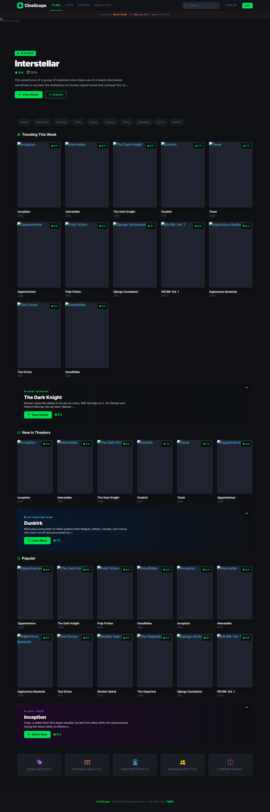
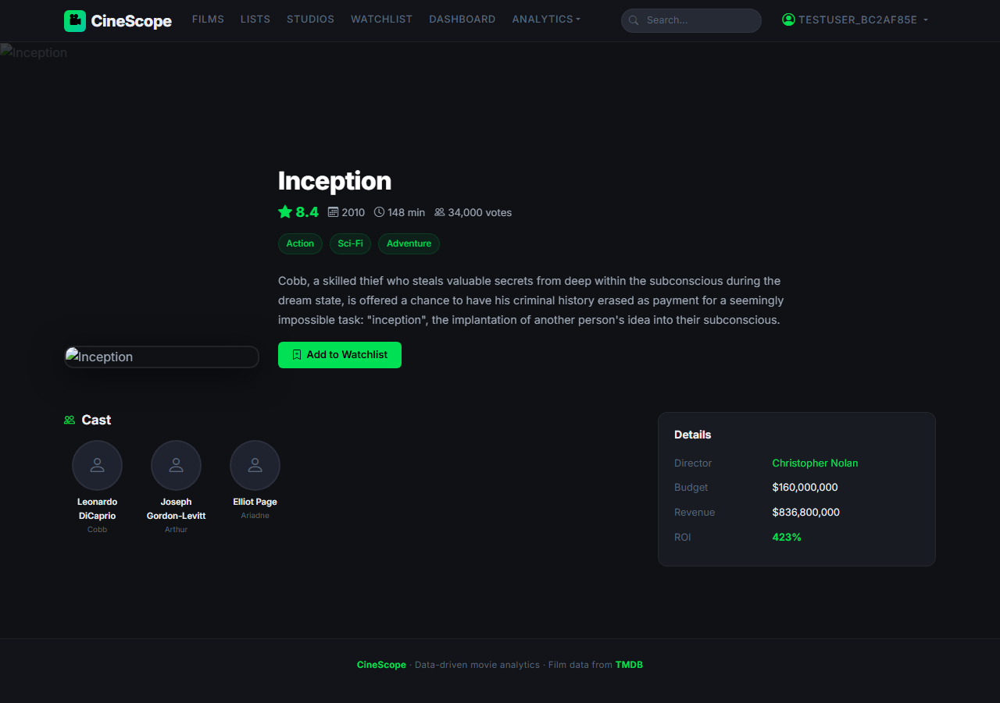
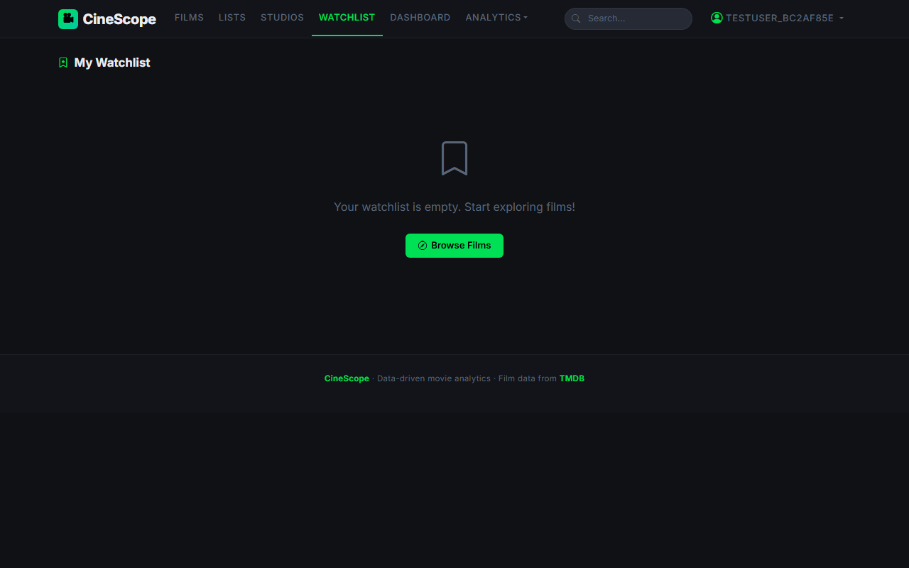
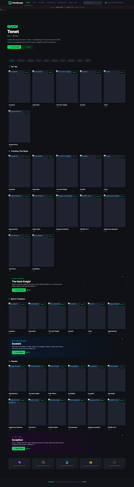
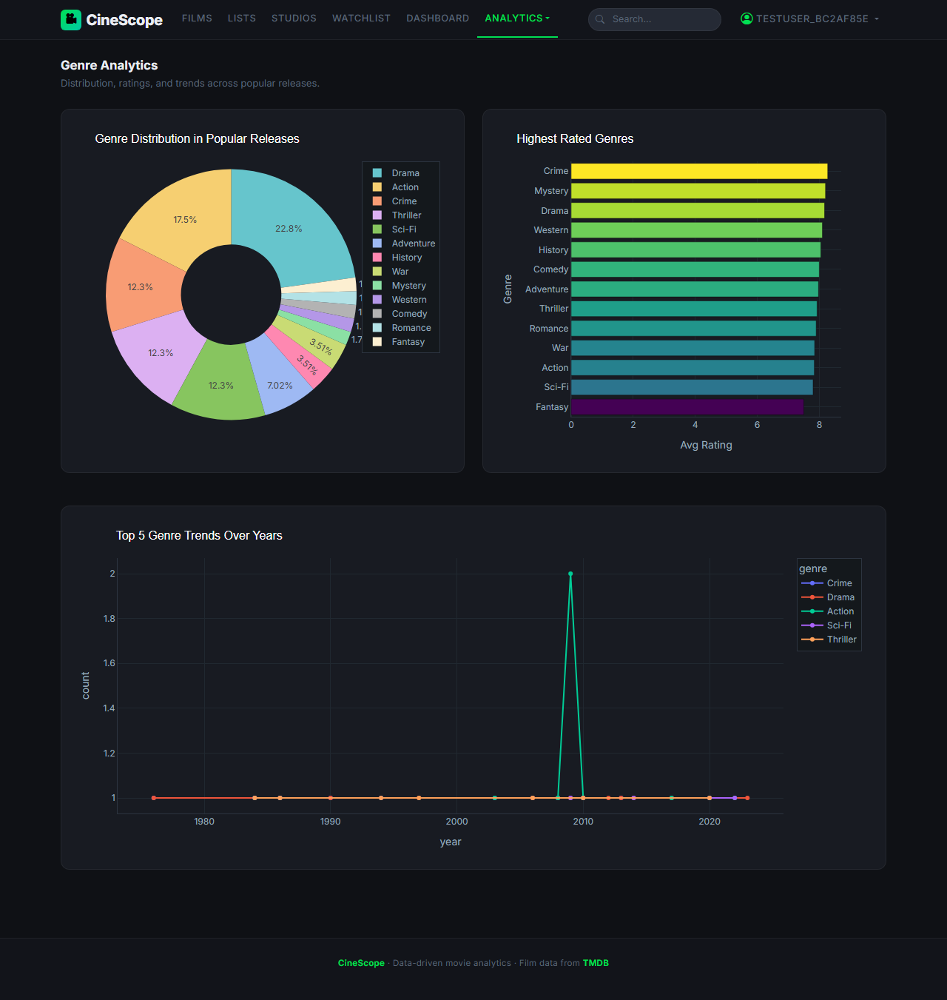
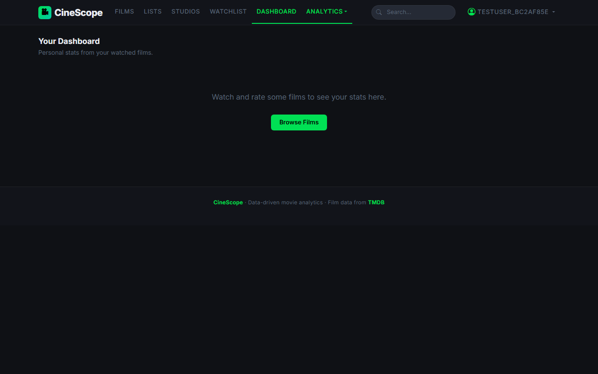

# INTERNSHIP / UDP / TRAINING REPORT
### (Monthly Progress Report)

---

## 1. Student Information

| Field | Detail |
| :--- | :--- |
| **Student Name** | *[Fill Student Name]* |
| **Enrollment Number** | *[Fill Enrollment Number]* |
| **Program/Branch** | B.Tech Computer Engineering / Information Technology |
| **Semester** | Semester 7 / 8 |
| **Contact Number** | *[Fill Contact Number]* |
| **Email ID** | *[Fill Email ID]* |

---

## 2. Internship / UDP / Training Details

| Field | Detail |
| :--- | :--- |
| **Type** | Internship / UDP Project |
| **Company/Organization** | *[Fill Company/Organization Name]* |
| **Department/Domain** | Full-Stack Web Development & Data Science |
| **Mentor Name (Company)** | *[Fill Company Mentor Name]* |
| **Mentor Name (Institute)** | *[Fill Institute Mentor Name]* |
| **Start Date** | *[Fill Start Date]* |
| **End Date** | *[Fill End Date]* |

---

## 3. Work Progress Summary

### a) Project Title: 
**CineScope: Data-Driven Movie Analytics and Recommendation Platform**

---

### b) Problem Statement:
Modern movie enthusiasts ("cinephiles") suffer from decision paralysis and information fragmentation. They are forced to navigate multiple isolated platforms to manage their watchlist, view detailed director filmographies, analyze personal viewing habits, and receive personalized recommendations. Existing applications often suffer from:
1. **Inefficient Information Hubs**: Platforms fail to combine custom watchlist tracking with advanced visual stats (similar to Spotify Wrapped) and robust content recommendations in a unified, modern interface.
2. **API Dependency Risks**: Direct integration with external film databases (e.g., TMDB) is susceptible to network latency, server throttling, and rate limits. Real-time REST queries are slow and resource-heavy, necessitating high-performance database caching mechanisms.
3. **Connectivity Limitations**: Modern web apps break completely without internet connectivity. Developers need an out-of-the-box local "Demo Mode" fallback to keep core user journeys responsive and testable without active API keys.

---

### c) Objectives:
The primary objectives of the **CineScope** project are to:
1. **Develop a Modular Backend**: Set up a robust, scalable Python Flask application using the **Application Factory Pattern** with clean database migrations.
2. **Implement Secure Access Control**: Create a secure user authentication system with password hashing (`scrypt`/`pbkdf2`) and session management via `Flask-Login`.
3. **Build an API Client & Caching Layer**: Establish a client service for the The Movie Database (TMDB) REST API with an custom SQL-based 24-hour cache manager (`APICache`) to minimize external calls and speed up query returns.
4. **Guarantee Offline Availability**: Design an intelligent local fallback dataset ("Demo Mode") comprising mock metadata for 40+ movies and 4 major film directors (Christopher Nolan, Quentin Tarantino, Martin Scorsese, James Cameron).
5. **Implement content-based recommendation logic**: Formulate a recommendation engine using **Pandas** and **NumPy** to rank suggested movies using vector cosine similarity metrics on users' watch histories.
6. **Construct Visual Dashboards**: Integrate interactive, Letterboxd-themed charts (Genre Distribution, Budget vs. Revenue Scatter plots, and Director Performance) using **Plotly** and **Pandas**.

---

### d) Proposed Methodology:
CineScope uses a Model-View-Controller (MVC) paradigm organized around Flask Blueprints to maintain a clean separation of concerns:

```
[User / Client Browser] 
       │▲
       ▼│
[Presentation Layer - HTML5 / Jinja2 / CSS / JS]
       │▲
       ▼│
[Controller Layer - Blueprints (auth, main, watchlist, directors, analytics)]
       │▲
       ▼│
[Service Layer - TMDB Client (tmdb.py), Recommendations Engine, Plotly Generator]
       │▲
       ▼│
[Data Layer - SQLite Database / APICache Table / Local JSON Fallback]
```

1. **Authentication Layer**: Manages user profiles. User sign-ups and logins are secured using salted password hashes in SQLite. Sessions are managed securely via server-side cookies.
2. **Watchlist & Rating System**: Users save movies to their watchlist, mark them as "watched", and assign ratings (1–10). This metadata serves as training inputs for the recommendation engine.
3. **TMDB Client & APICache Service**: Fetches information from TMDB. When a request is made, the app checks the `APICache` table first. If a match is found and is younger than 24 hours, the cached JSON payload is returned. Otherwise, the app queries TMDB, saves the result in `APICache` for future visits, and returns it. If the API key is missing or the network fails, it falls back to the static local JSON structure.
4. **Cosine Similarity Recommendation Engine**:
   - Compiles user's watched items and pulls their details.
   - Calculates weighted genre and director preference lists based on user ratings.
   - Normalizes lists to build a **User Preference Profile Vector**.
   - Gathers movie candidates (Trending, Popular, and Top Genre Discover lists).
   - Generates candidate attribute vectors and computes their **Cosine Similarity** against the user profile.
   - Returns top-scoring unvisited movies.
5. **Interactive Visualization Pipeline**:
   - Pandas cleanses and groups watch histories or general popular movie dataframes.
   - Plotly creates custom figures styled with CSS HSL theme tokens matching dark aesthetics (`#0B0E11` backgrounds, Spotify/Letterboxd accent greens `#00C030`, oranges `#ff8000`, and secondary text `#9ab`).
   - SVG charts are embedded directly in dashboard pages.

---

### e) Expected Outcomes:
- A fully secure, responsive dark-themed web platform for cinephiles.
- An automated watchlist tool with quick rating and status triggers.
- Real-time content recommendations that dynamically update as watchlists change.
- Multi-dimensional, interactive dashboards demonstrating movie statistics and director comparisons.
- High-efficiency cache layers resulting in fast page loads (<100ms for cached views).

---

### f) Future Scope:
- **Collaborative Filtering**: Incorporate user-to-user recommendations utilizing large datasets (e.g., MovieLens) alongside content-based vectors.
- **Social Features**: Let users share watchlists, write reviews, follow other cinephiles, and view side-by-side comparison stats.
- **Streaming Provider Links**: Integrate the JustWatch API to show users where selected movies are streaming in their local region.
- **Cloud Deployment**: Containerize the app using Docker and set up automated deployments on platforms like AWS or Render.

---

### g) Weekly Work Plan (Gantt Chart) - Phase 1:
*8-week schedule covering Reporting 1 (Foundation phase). W = Week.*

| Task / Activity | W1 | W2 | W3 | W4 | W5 | W6 | W7 | W8 |
| :--- | :---: | :---: | :---: | :---: | :---: | :---: | :---: | :---: |
| **Requirement study & tech stack finalization** | █ | | | | | | | |
| **Flask app factory, SQLAlchemy models, Blueprints** | █ | █ | | | | | | |
| **Auth module – register / login / profile** | | | █ | █ | | | | |
| **TMDB API client + 24h cache + demo fallback** | | | █ | █ | | | | |

---

## 4. Tasks Accomplished
- **Tech Stack & System Design**: Finalized requirements and established a pythonic stack: Python Flask, SQLite (SQLAlchemy), requests, Pandas, NumPy, Plotly, and customized dark CSS styling.
- **Database Modeling**: Designed tables in [models.py](file:///d:/INTERNSHIP%20PROJECT/app/models.py): `User` (credentials), `Watchlist` (user movie records, ratings, flags), and `APICache` (REST API caching schema).
- **Application Factory Pattern**: Structured the modular app inside [__init__.py](file:///d:/INTERNSHIP%20PROJECT/app/__init__.py) with database bootstrap actions, global filters, and blueprint setups.
- **Blueprints & Endpoint Routing**: Set up blueprints in [auth.py](file:///d:/INTERNSHIP%20PROJECT/app/routes/auth.py), [main.py](file:///d:/INTERNSHIP%20PROJECT/app/routes/main.py), and [watchlist.py](file:///d:/INTERNSHIP%20PROJECT/app/routes/watchlist.py).
- **Authentication Implementation**: Programmed user signup, login with secure hashing, and custom session-based dashboard redirection.
- **TMDB Service Client**: Created the API client in [tmdb.py](file:///d:/INTERNSHIP%20PROJECT/app/services/tmdb.py) supporting movie details, casts, searching, and trending query returns.
- **APICache Layer**: Coded caching operations inside `APICache` with automatic 24-hour expiration verification.
- **Demo Fallback Implementation**: Configured the "Demo Mode" fallback database containing full metadata of 4 directors and 40 movies to guarantee local execution when an API key is missing.

---

## 5. Tasks in Progress / Next Plan
- **Content-Based Matcher**: Finalizing the recommendation calculation in [recommendations.py](file:///d:/INTERNSHIP%20PROJECT/app/services/recommendations.py) utilizing normalized Pandas vectors.
- **Plotly Visuals Integration**: Polishing dashboard metrics charts in [analytics.py](file:///d:/INTERNSHIP%20PROJECT/app/services/analytics.py) including Budget-Revenue scatter plots and Cinephile stats.
- **UI Dashboard Design**: Designing responsive index dashboards, watchlist grids, and director profiles with modular layouts.
- **Testing & Verification**: Drafting automated tests to verify login forms, watchlist operations, and recommendation scores.

---

## 6. Learnings / Skills Acquired
- **Software Architecture**: Structuring Flask web applications using the Application Factory pattern and Blueprint route isolation.
- **Database Engineering**: Utilizing SQLAlchemy to structure relational database tables, manage user authentication sessions, and construct payload caching logic.
- **Data Engineering & Science**: Parsing, transforming, and vectorizing semi-structured JSON payloads into Pandas DataFrames and performing matrix normalization using NumPy.
- **API Architecture**: Constructing robust REST clients with fallback mechanisms, exception handling, and automatic local caching.
- **Front-End Styling**: Writing modern dark-theme stylesheets using HSL systems, transitions, hover animations, and custom CSS grids.

---

## Evaluation (To be filled by Mentor (Institute))

| Criteria | Bloom's Level | Excellent (20) | Good (15) | Average (10) | Poor (5) | Marks Obtained (Out of 20) |
| :--- | :---: | :--- | :--- | :--- | :--- | :---: |
| **Problem Definition** | L4-Analyze | Clearly defined, justified real-world problem | Defined but lacks depth | Vague problem | No clear problem | |
| **Project Title Relevance** | L2-Understand | Highly precise and aligned | Mostly relevant | Partially relevant | Misleading | |
| **Scope of Work** | L5-Evaluate | Well-defined scope, deliverables, constraints | Defined with minor gaps | Broad/unclear | No scope | |
| **Literature Study** | L4-Analyze | 3-5 sources analyzed critically | Sources listed | Minimal references | No study | |
| **Clarity & Presentation** | L3-Apply | Structured, professional | Minor issues | Some confusion | Poor | |
| **Total Marks** | | | | | | ** / 100** |

---

## 7. Results / Output Screenshots

### Screenshot 1: Movie Explorer (Home Page)
Displays the CineScope home page with trending and popular movies retrieved from the local database. The interface demonstrates dynamic movie loading, responsive Bootstrap-based design, movie cards, and the integrated search functionality for discovering movies.


### Screenshot 2: Movie Detail Page
Displays detailed information about the selected movie, including poster, overview, genres, release date, ratings, cast information, and the Add to Watchlist feature. 


### Screenshot 3: Personal Watchlist
Shows the authenticated user's personal watchlist containing saved movies. Users can add or remove movies, mark movies as watched, and maintain personal ratings, demonstrating database integration and watchlist management functionality.


### Screenshot 4: Recommendation Engine Output
Displays personalized movie recommendations generated using the content-based recommendation algorithm based on the user's watchlist and movie similarity, demonstrating the implementation of the recommendation engine.


### Screenshot 5: Analytics Dashboard
Displays interactive Plotly dashboards visualizing movie genre distribution, revenue analysis, director insights, and user watch statistics, demonstrating data processing and analytical visualization capabilities.


### Screenshot 6: Cinephile / User Profile Dashboard
Displays the user's profile dashboard containing personal movie statistics, watch history, total watched movies, ratings summary, and other personalized insights, demonstrating user-specific data aggregation and profile management.

